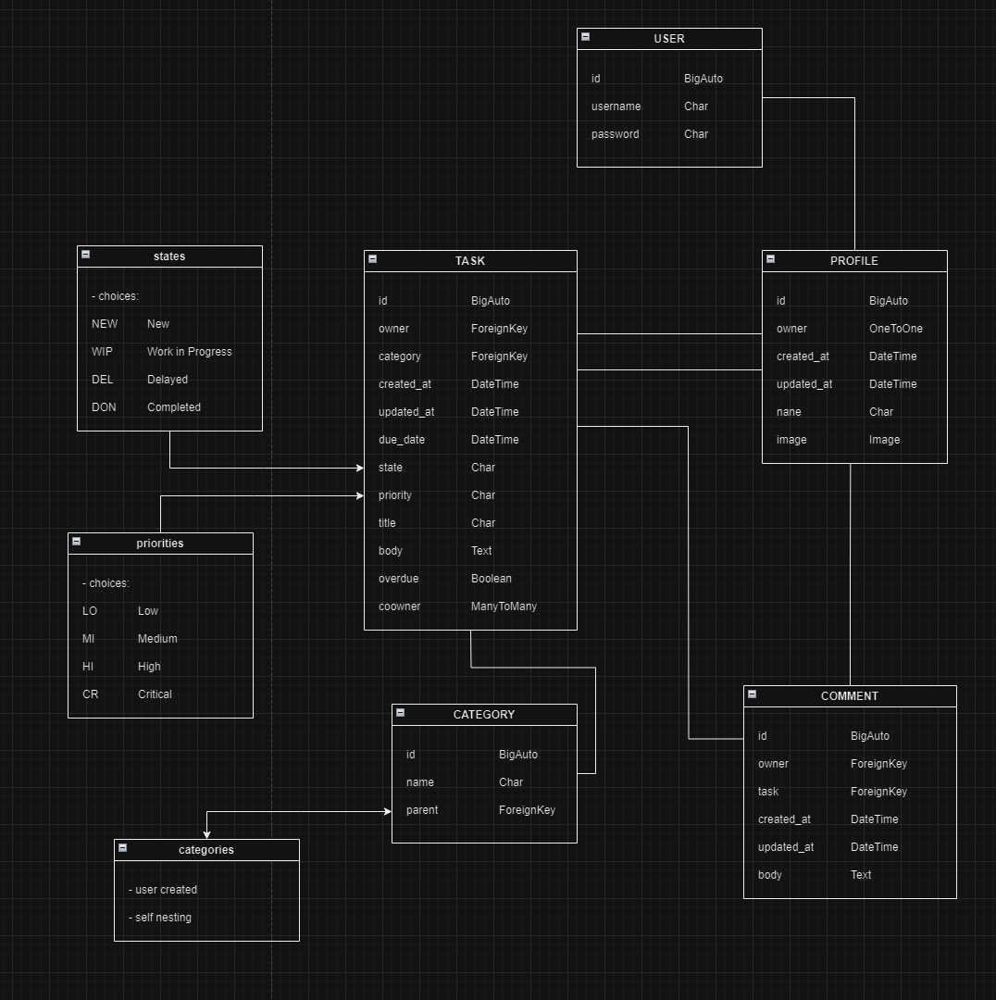

<h1 align="center"><a name="top">Code Institute P5 API for Schedulize Project (P5)</a></h1>

[View the live api here](https://chrotesque-cip5-api-7fc69c3bebb4.herokuapp.com/) and [view the live project here](https://chrotesque-cip5-04d27b18c413.herokuapp.com/)

# Table of Contents

0. [WIP](#wip-)
1. [Overview](#overview-)
1. [UX](#ux-)
1. [Model/Agile](#modelagile-)
1. [Features](#features-)
1. [Technologies Used](#technologies-used-)
1. [Testing](#validation-and-testing-)
1. [Deployment](#deployment-)
1. [Credits](#credits-)

<br />

# **WIP** ([^](#table-of-contents))
### As this project is still a work in progress, certain features are incomplete:
- filtering is enabled for tasks but not fully implemented, point was to see if it works and later implement it further once usefulness has been evaluated
- the models might require some additional work (changes) to work with the project as required, as currently all information is visible to all users, the goal will be that tasks are user specific (including co-owners)
  - the focus is currently on the front-end and this will be revisited later
- there's an issue with static files which is why the API isn't rendered correctly once deployed, a solution is still waiting to be found 
- autommated testing missing
- syntax / style checking quite possibly incomplete, focus was on this during development but certain style errors might have slipped my attention
- whatever else unforeseen issue exists
- this readme is incomplete as a result of the aforementioned

<br />

# **Overview** ([^](#table-of-contents))
This API handles data for the Project [Schedulize](https://github.com/Chrotesque/ci-portfolio-project-5), providing authentication, tasks, categories, comments as well as user profiles to the front-end of Schedulize.

<br />

# **UX** ([^](#table-of-contents))

## Five Planes of UX

### Strategy
- Separation of Back End and Front End and use of frameworks make for easy expandability and allows indepentend development

### Scope
- The API provides authentication and data for all other relevant database models like comments, tasks, categories & profiles

### Structure
- There is no inherent UI to be navigated by users, the API is meant to be used by the above mentioned project itself. It does provide the option to be navigated by developers for data management through the /admin link part of Django Rest Framework as well as testing by manual testing of the data the API provides though:
/categories, /comments, /profiles, /tasks

### Skeleton
- No wireframes nor a page view were created for this API as it's not meant to be viewed by users

### Surface / Design
- Same as skeleton plane, no user interaction is expected

<br />

# **Model** ([^](#table-of-contents))

 

- User model
  - Standard Django built in user authentication including dj-rest-auth
    - username: user chosen name for the user account
    - password: user chosen password for the user account

<br />

- Profile model
  - automatically created via signal after user creation
    - owner: the associated user account
    - created_at: the datetime when the profile was created
    - updated_at: the datetime when the profile was last updated
    - name: a public facing name that can differ from the user model username
    - image: a public facing avatar image

<br />

- Category model
  - a self nesting simple model to offer customization options to the user, where pre-provided categories might fall short
    - name: the name of the category
    - parent: the parent id of the category (optional)

<br />

- Task model
  - the main model of the project
    - owner: the user account associated who created the task
    - category: user chosen category for the task
    - created_at: the datetime when the task was created
    - updated_at: the datetime when the task was last updated
    - due_date: the datetime when the task is due (optional)
    - state: a list of 4 provided options to signify the state of the task:
      - New
      - Work in Progress
      - Delayed
      - Completed
    - priority: a list of 4 provided options to state the priority of the task:
      - Low
      - Medium
      - High
      - Critical
    - title: the title of the task (optional)
    - body: the main body of the task that can host more information (optional)
      - (either title or body have to be filled in)
    - overdue: boolean to show if a task is overdue
    - coowner: additional user accounts that are meant to have full access to the task for collaboration

<br />

- Comments model
  - works in conjunction with the task model to allow for communication within a task or to allow the user to leave notes
    - owner: the user account associated who created the comment
    - task: the task the comment was left in
    - created_at: the datetime the comment was created
    - updated_at: the datetime the comment was last updated
    - body: the main body of the comment

<br />

# **Features** ([^](#table-of-contents))

## Authentication
- dj-rest-auth handles authentication for the API, as all interactions apart from reading with the project require a user account this is essential

## Ordering & Searching
- information of all models can be ordered and searched within

<br />

# **Technologies Used** ([^](#table-of-contents))

## Languages
- <a href="https://en.wikipedia.org/wiki/Python_(programming_language)" target="_blank">Python</a>

## Frameworks & associated Packages
- <a href="https://de.wikipedia.org/wiki/Django_(Framework)" target="_blank">Django</a>
- <a href="https://www.django-rest-framework.org/" target="_blank">Django Rest Framework</a>
- <a href="https://dj-rest-auth.readthedocs.io/en/latest/" target="_blank">dj-rest-auth</a>
- <a href="https://pypi.org/project/dj-database-url/" target="_blank">dj_database_url</a>
- <a href="https://pypi.org/project/psycopg2/" target="_blank">psycopg2</a>
- <a href="https://gunicorn.org/" target="_blank">gunicorn</a>
- <a href="https://django-allauth.readthedocs.io/en/latest/installation.html" target="_blank">django allauth</a>
- <a href="https://cloudinary.com/" target="_blank">cloudinary</a>
- <a href="https://pypi.org/project/django-cors-headers/" target="_blank">django cors headers</a>
- <a href="https://python-pillow.org/" target="_blank">pillow</a>
- <a href="https://django-rest-framework-simplejwt.readthedocs.io/en/latest/" target="_blank">simplejwt</a>

## Templates & Services
- <a href="https://github.com/Code-Institute-Org/ci-full-template" target="_blank">Code Institute Template</a> - Basis for this API
- <a href="https://github.com/" target="_blank">Github and Git</a> - Used for version control through CLI in Gitpod
- <a href="https://gitpod.io/" target="_blank">Gitpod</a> - Online IDE used for this API
- <a href="https://www.elephantsql.com/" target="_blank">ElephantSQL</a> - PostgreSQL database used for this API
- <a href="https://www.heroku.com/" target="_blank">Heroku</a> - For Deployment
 
 <br />

# **Testing** ([^](#table-of-contents))

- TBD

<br />

# **Deployment** ([^](#table-of-contents))

In order to create a clone of the repository, Github has created a handy guide right <a href="https://docs.github.com/en/repositories/creating-and-managing-repositories/cloning-a-repository#cloning-a-repository-to-github-desktop" target="_blank">here</a>. Also a Github account will be required for further action.

## Creating the Django app

- To fully replicate the process I went through, the following template would be required as it contains a lot of prerequesites: [Code Institute Gitpod Full Template](https://github.com/Code-Institute-Org/ci-full-template)
- Make sure the [Gitpod - Always ready-to-code](https://chrome.google.com/webstore/detail/gitpod-always-ready-to-co/dodmmooeoklaejobgleioelladacbeki) chrome extension is installed, then click on the "Use This Template" Button on the template and once it is in your repository, you should see a green Gitpod button on the top right next to the code button, click on that and wait for the workspace to be initialized.
- Use the Terminal (or open a new one) and install Django and gunicorn
> pip3 install 'django<4' gunicorn
- Install the database libraries
> pip3 install dj_database_url psycopg2
- Then create the project
> django-admin startproject projectname 
- and create the app
> python3 manage.py startapp appname
- Add the created app to the list of installed apps in settings.py.
- Be sure to create the requirements.txt
> pip freeze --local > requirements.txt
- Migrate your changes
> python3 manage.py migrate
- Then start your server and check if everything runs fine
> python3 manage.py runserver
- You should now see the basic deployment welcome page of Django.

## Deployment on Heroku

- Log in to [Heroku](https://www.heroku.com)
- In your Dashboard click on "New" and select "Create New App"
- Enter the App name and select your region then click on "Create App"
- Click on "Resources" and add the Heroku Postgres database to your App
- Next, click on "Settings" in the Top Nav and scroll down to "Config Vars". Click on "Reveal Config Vars"
- Add the following Variables: 
  - Port
  > 8000
  - DISABLE_COLLECTSTATIC
  > 1
  - SECRET_KEY
  > your_secret_key
  - CLOUDINARY_URL
  > your_cloudinary_url
  - DATABASE_URL
  > your_database_url
  - ALLOWED_HOST
  > link of your deployed API without the leading 'HTTPS://' and trailing '/', ie: 
    ```
    my_api_app-randomsymbols.herokuapp.com
    ```
  - CLIENT_ORIGIN
  > full link of the deployed Project that uses the API without the trailing '/' at the end, ie: 
    ```
  https://api_using_app-randomsymbols.herokuapp.com
    ```
  - CLIENT_ORIGIN_DEV
  > full link of the Gitpod workspace without the trailing '/' at the end, ie: 
    ```
  https://username-partial_app_name-random_letters.gitpod.io
  ```

- Now select "Deploy" in the top navigation. Select GitHub as the deployment option and connect to your GitHub repository. Search for your repository name and click on the "connect" button.
- Further down on the page you will be able to choose between automatic and manual deployment as preferred

## Finalizing Deployment 

- Create a file called "Procfile" with one line of content
> web: gunicorn your_project_name.wsgi
- Once development is finished change the 'DEV' variable to '0' in env.py
- You can also delete the Config Var "DISABLE_COLLECTSTATIC = 1" in your Heroku App and deploy again.

### Forking the GitHub Repository

By forking the GitHub Repository we make a copy of the original repository on our GitHub account to view and/or make changes without affecting the original repository by using the following steps...

1. Log in to GitHub and locate the [GitHub Repository](https://github.com/)
2. At the top of the Repository (not top of page) just above the "Settings" Button on the menu, locate the "Fork" Button.
3. You should now have a copy of the original repository in your GitHub account.

### Making a Local Clone

1. Log in to GitHub and locate the [GitHub Repository](https://github.com/)
2. Under the repository name, click "Clone or download".
3. To clone the repository using HTTPS, under "Clone with HTTPS", copy the link.
4. Open Git Bash
5. Change the current working directory to the location where you want the cloned directory to be made.
6. Type `git clone`, and then paste the URL you copied in Step 3.

```
$ git clone https://github.com/YOUR-USERNAME/YOUR-REPOSITORY
```

7. Press Enter. Your local clone will be created.

```
$ git clone https://github.com/YOUR-USERNAME/YOUR-REPOSITORY
> Cloning into `CI-Clone`...
> remote: Counting objects: 10, done.
> remote: Compressing objects: 100% (8/8), done.
> remove: Total 10 (delta 1), reused 10 (delta 1)
> Unpacking objects: 100% (10/10), done.
```

<br />

# **Credits** ([^](#table-of-contents))

- [Sample Readme Template](https://github.com/Code-Institute-Solutions/SampleREADME/blob/master/README.md) used at least partially from Code Institute